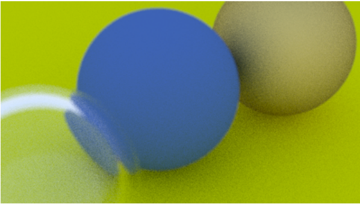

# Multithreaded CPU Ray Tracer
This project implements a physically-based ray tracer in C++ built on the foundation of *Ray Tracing in One Weekend*, extended with a custom multithreading system that parallelizes rendering across all available CPU cores. Given a scene description, the renderer shoots rays per pixel with configurable sample counts and bounce depth, producing a full PPM image. The multithreading extension was added independently to explore concurrent programming, thread-safe RNG design, and the performance characteristics of an embarrassingly parallel workload.

## Features
- Full Whitted-style ray tracing with recursive light bouncing
- Three material types: Lambertian diffuse, metal with configurable fuzz, and dielectric (glass)
- Defocus blur (depth of field) and anti-aliasing via stratified sampling
- Parallelized rendering across all logical CPU cores using `std::thread`
- Per-thread isolated `std::mt19937` RNG seeded via `std::random_device` - no locks, no data races
- Lock-free framebuffer written concurrently by non-overlapping thread row ranges
- Configurable image resolution, samples per pixel, max bounce depth, and camera parameters

## Technologies/Logic Used
- C++17
- `std::thread`, `std::vector<std::thread>`
- `std::mt19937` / `std::random_device`
- `std::chrono` for render timing
- Physically-based reflection and refraction (Snell's law, Schlick approximation)
- Monte Carlo integration for anti-aliasing and diffuse scattering
- PPM image output

## How It Works
The renderer builds a scene of spheres with randomized materials, then calls `camera::render()`. Rather than writing pixels directly to stdout in a single loop, the renderer first allocates a flat `std::vector<color>` framebuffer sized to `image_width * image_height`. It then spawns N threads (where N = `std::thread::hardware_concurrency()`), dividing image rows into contiguous bands, one per thread, with remainder rows distributed across the first few threads to ensure no row is skipped.

Each thread runs its own inner loop over its assigned rows and columns, accumulating color samples per pixel by calling `get_ray()` and `ray_color()`. Both functions accept a `std::mt19937&` parameter, threading a per-thread RNG instance through the entire call chain: including `sample_square()`, `defocus_disk_sample()`, `random_unit_vector()`, and every material's `scatter()` method. Each thread writes directly into its non-overlapping slice of the framebuffer, requiring no mutexes. After all threads are joined, the main thread iterates the framebuffer in order and writes the PPM output to stdout.

## Results & Findings


Parallelizing a ray tracer is a textbook example of an embarrassingly parallel problem: each pixel is fully independent, so there is no shared mutable state to protect during the render. The interesting challenge turned out not to be the threading itself, but the RNG. The original `random_double()` used `std::rand()`, a global function with global state that is not thread-safe. Naively spawning threads without addressing this causes a data race on every random number call, producing corrupted renders with subtle statistical artifacts. The fix, giving each thread its own `std::mt19937` instance seeded independently, also improved randomness quality significantly over `std::rand()`.

Implementing the overloaded `scatter()` signature with `std::mt19937&` required threading the RNG parameter through the entire material hierarchy, which made the data flow of randomness through the renderer very explicit and easy to reason about.

## Challenges
The steepest part of extending the tutorial codebase was the RNG refactor. Because `random_double()` is called deep inside material scatter functions, `vec3` random helpers, and camera sampling methods, making the threading safe required adding overloaded signatures across multiple files: `rt.h`, `vec3.h`, `camera.h`, and `material.h`. Each overload accepts a `std::mt19937&` and passes it further down, forming a parallel call chain alongside the original single-threaded one.

A subtler bug came from lambda capture: `start_row` and `end_row` are local variables that change each loop iteration, so capturing them by reference inside the thread lambda would cause all threads to see the final loop values. Capturing them by value ensures each thread gets a snapshot of its own row range at spawn time.

## Future Improvements
- BVH (Bounding Volume Hierarchy) acceleration structure to reduce ray-object intersection cost from O(n) to O(log n)
- Progress reporting that works correctly with parallel threads (atomic scanline counter)
- PNG output support instead of PPM
- *Ray Tracing: The Next Week* extensions: motion blur, texture mapping, and lights
- GPU acceleration via CUDA or compute shaders

## Building

```bash
g++ -std=c++17 -O2 -o raytracer main.cc
./raytracer > output.ppm
```

## License
Distributed under the MIT License. See `LICENSE` for more information.
